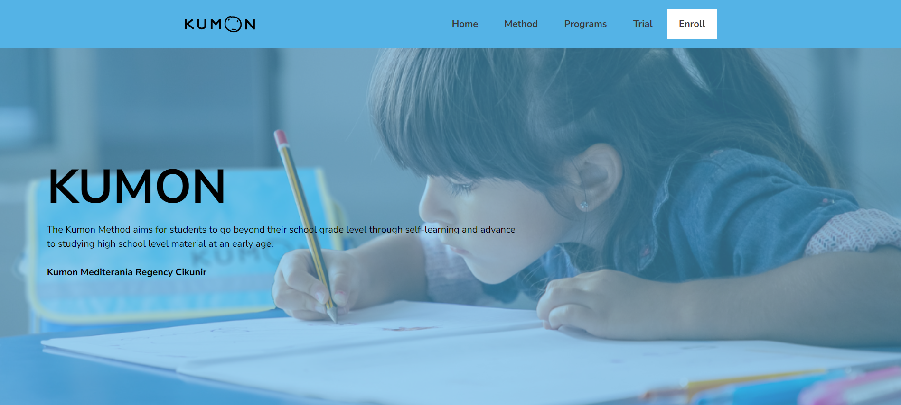

# RevoU Project Milestone 1

Hello my name is Raden Wisnu Andhika Pranidhia. This is a project assignment from RevoU about making a company web profile. Here I present you Kumon Mediterania Regency Cikunir's web company profile. I tried my best focusing on making a simplistic and nice looking website while making the theme as similar as possible from Kumon's design without disregarding accessibility and performance of the web. If you have any question or anything else regarding the website, feel free to contact me at [linkedin](https://www.linkedin.com/in/raden-wisnu-andhika-pranidhia-b17a16196/), [email](mailto:radenwisnu21@gmail.com). I am open to any criticism and suggestion. Thank you!

## STRUCTURE

- Navbar
- Header
    - Hero Section
- Main
    - Method Section
    - Program Section
    - Trial Section
    - Instructor Section
- Footer

## DEPLOYMENT

This project has been deployed using netlify. Here are the following steps to deploy using netlify:

1. Log in or sign up to netlify

You can use your github account to directly connect your github account to netlify or you can use any existing email and connect your github later when you want to deploy automaticaly using github.

