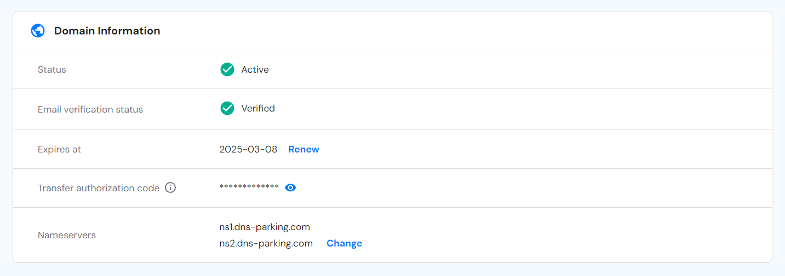
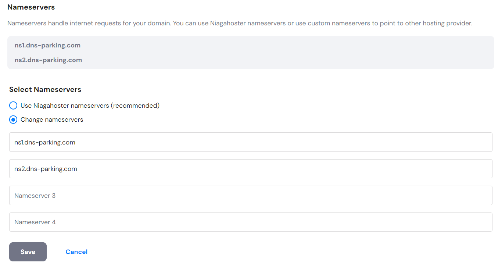
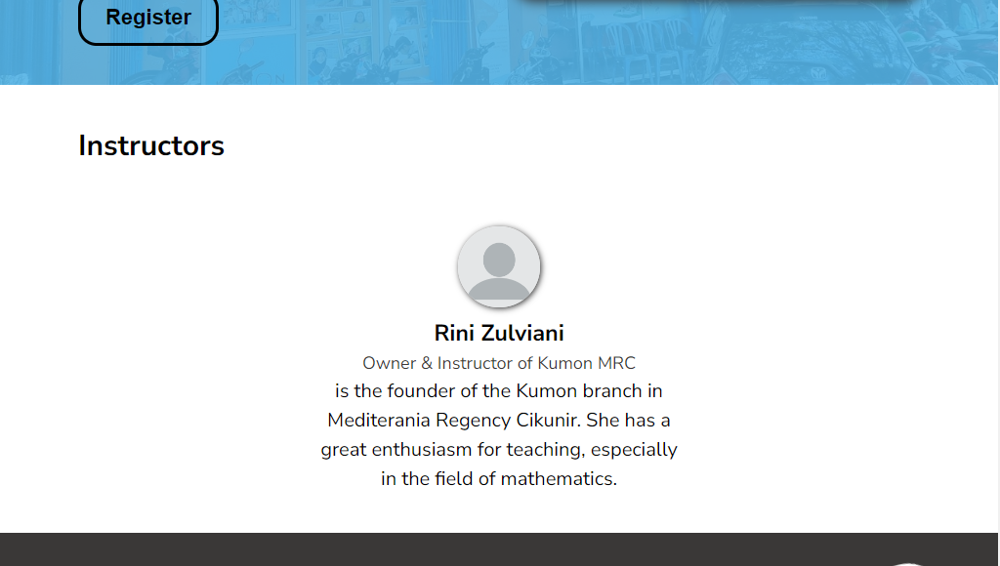

# RevoU Project Milestone 1


Hello my name is Raden Wisnu Andhika Pranidhia. This is a project assignment from RevoU about making a company web profile. Here I present you Kumon Mediterania Regency Cikunir's web company profile. I tried my best focusing on making a simplistic and nice looking website while making the theme as similar as possible from Kumon's design without disregarding accessibility and performance of the web. If you have any question or anything else regarding the website, feel free to contact me at [linkedin](https://www.linkedin.com/in/raden-wisnu-andhika-pranidhia-b17a16196/), [email](mailto:radenwisnu21@gmail.com). I am open to any criticism and suggestion. Thank you!

You can access the website using [this link!](https://kumonmrc.site)

## STRUCTURE

- Navbar
- Header
    - Hero Section
- Main
    - Method Section
    - Program Section
    - Trial Section
    - Instructor Section
- Footer

## BUILDING PROCESS

1. Making the structure of the html and also add the content.


2. Add css styling, fonts, etc that I want to use.


3. Add responsiveness for a different layout devices using media query.


## SETUP AND RUN PROJECT

To copy the project repository to your local machine, you can use this code in your terminal CLI:

```bash
git clone https://github.com/RevoU-FSSE-4/milestone-1-RWAndhika.git
```

To run it, open `index.html` file in your web browser.

## DEPLOYMENT

This project has been deployed using netlify. Here are the following steps to deploy using netlify and set a custom domain using Niagahoster domain:

1. Log in or sign up to netlify

You can use your github account to directly connect your github account to netlify or you can use any existing email and connect your github later when you want to deploy automaticaly using github.


2. Deploy with github

You can use deploy with github so everytime your project got updated in your github repository, netlify will auto re-deploy your project so you don't need to manually re-deploy your project everytime there is an update or changes.


You will be asked to connect and authenticated your github account to your netlify account if you aren't logged in using your github account. Then, you can choose the project that you want to deploy and then click deploy.


3. Buy a domain at Niagahoster

Sign up or log in to Niagahoster if you already have an account. There you can buy the domain that you want.


4. Set up a custom domain to your project

Go back to the netlify and then click the __set up a custom domain__. You can enter the domain name that you buy from Niagahoster and then click add domain.


5. Set up External DNS

Click on options on the primary domain and then choose __Set up Netlify DNS__.


Then click verify and complete the following steps until it asked you to change your domain's name server with names provided here.


Go back to Niagahoster to change the domain's name server in the manage menu on the domain that you bought.






It might take a while for the configuration to complete itself. You can see on the netlify if the custom domain already set up properly and complete.


6. Set up Complete!

Lastly you can try to access your website using the custom domain.


## Specific design choices or considerations

1. At the instructor section, I chose to use flex and flex wrap on the card container so everytime there is a new instructor that I want to show on the website, I can make a copy of the card item and then change the content so the the new card will fit nicely into the container.


```html
<!-- instructor -->
        <section>
            <div class="container">
                <h2 class="section-title">Instructors</h2>
                <div class="card-container">
                    <div class="card-item">
                        
                        <h3>Rini Zulviani</h3>
                        <p class="instructor-title">Owner & Instructor of Kumon MRC</p>
                        <p>is the founder of the Kumon branch in Mediterania Regency Cikunir. She has a great enthusiasm
                            for teaching, especially in the field of mathematics.</p>
                    </div>
                </div>
            </div>
        </section>
```
```css
.card-container {
    display: flex;
    justify-content: center;
    align-items: center;
    flex-wrap: wrap;
    text-align: center;
    gap: 2em;
    margin-bottom: 2em;
}
```

2. I also considered to just use a media query to add responsiveness to the menubar so I don't need to use hamburger button when using a small layout devices. (To not add JS in this project)


3. I put nav tag inside body tag so I could make a sticky navbar without using JS.

```html
<body>
    <nav>...
    </nav>

    <header>...
    </header>


    <main>...
    </main>

    <footer>...
    </footer>
</body>
```
With this the navbar will always be sticky on every section because the navbar's parents is the body tag, not inside header or main. If I put navbar inside header tag or main tag, the sticky will only work on either header section or main section. Thus, I would have to use JS to make the navbar works.

[reference for this trick](https://alvarotrigo.com/blog/sticky-navbar/#:~:text=How%20this%20Makes%20the%20Navbar%20Sticky)

## Reference

This is my references when making this project:
- [luxury shop](https://github.com/RevoU-FSSE-2/week-5-muhammad-avicena/tree/main)
- [Budo academy](http://budoacademy.rf.gd/)
- [kumonglobal](https://id.kumonglobal.com/)
- [kumon](https://www.kumon.com/)
- [kumonphilippines](https://kumonphilippines.com/discover-the-path-to-academic-success-and-beyond/)
- [kumon logo](https://logos-world.net/kumon-logo/)
- [icons](https://uxwing.com/)
- [fonts](https://fonts.google.com/specimen/Nunito+Sans)


[](https://classroom.github.com/a/NtxSJSoQ)
